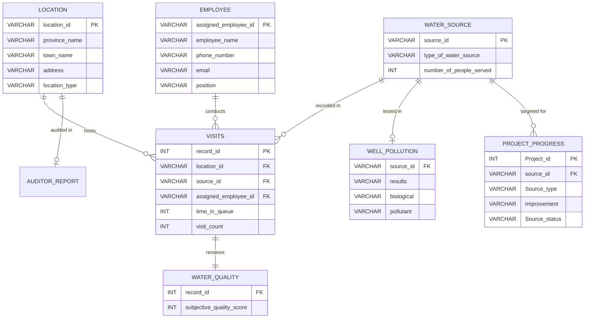

# Project Maji Ndogo: Water Crisis Analytics & Infrastructure Routing

## 📌 Executive Summary
This project is an end-to-end data engineering and analytics solution designed to address a severe water crisis in the fictional country of Maji Ndogo. Using advanced SQL, I analyzed a database of over 60,000 records to audit water infrastructure, uncover a government fraud ring, and automatically generate a prioritized, mathematically-driven deployment schedule for engineering repair teams.

**Tools Used:** SQL (MySQL/SQLite)
**Core Skills:** Common Table Expressions (CTEs), Window Functions, Complex Joins, Views, Data Cleaning, Flow Control (`CASE` statements).


---

## 🛑 The Business Problem
Maji Ndogo is facing a severe water crisis affecting 27.4 million people. Citizens are forced to rely on contaminated wells, broken home infrastructure, and raw river water. Furthermore, independent auditors suspected that regional field workers were accepting bribes to falsify water quality reports. 

**My objective was to:**
1. Clean and standardize the raw infrastructure data.
2. Cross-reference independent auditor reports to catch corrupt officials.
3. Consolidate the clean data to identify actionable insights.
4. Generate a tracking board of specific repair tickets for engineering teams.

---

## 🔍 The Investigation & Methodology

### Phase 1 & 2: Data Exploration and Cleaning
* Analyzed the ERD mapping `location`, `water_source`, `visits`, and `well_pollution` tables.
* Cleaned the data by standardizing employee emails and using string manipulation (`TRIM`, `LOWER`) to fix hidden whitespace errors that would have broken future `JOIN` operations.

### Phase 3: Fraud Detection (The Auditor Investigation)
By joining the internal employee reports with the independent auditor scores, I discovered a massive discrepancy. 
* I utilized **CTEs** and **Window Functions** to establish a global average for reporting errors.
* I successfully isolated four specific employees (Malachi Mavuso, Lalitha Kaburi, Zuriel Matembo, and Bello Azibo) who were accepting bribes to mark biologically contaminated wells as "Clean."

### Phase 4: Actionable Routing
I created a master `VIEW` (`combined_analysis_table`) to securely join all tables without dropping data (utilizing `LEFT JOIN` for pollution records). I then built a `Project_progress` tracking table and used complex `CASE` statements to automatically generate 25,398 specific engineering tasks based on business logic:
* **Rivers:** Route teams to drill wells.
* **Contaminated Wells:** Install UV and/or Reverse Osmosis filters.
* **Broken Home Taps:** Dispatch teams to diagnose local infrastructure.
* **Shared Taps (High Wait Times):** Used the `FLOOR()` mathematical function to calculate exactly how many extra taps were needed to bring queue times under the UN standard of 30 minutes.
 ```mermaid
graph TD
    A([Start: Evaluate Water Source]) --> B{Is visit_count = 1?}
    
    B -- Clean --> C([Drop Record from Dataset])
    B -- Chemical Contamination --> D{What is the Source Type?}

    %% River Branch
    D -- River --> E[Action: Drill well]
    
    %% Broken Tap Branch
    D -- Broken Home Tap --> F[Action: Diagnose local infrastructure]
    
    %% Shared Tap Branch
    D -- Shared Tap --> G{Is Queue Time >= 30 mins?}
    G -- Clean --> C
    G -- Chemical Contamination --> H["Action: Install FLOOR(time/30) extra taps nearby"]
    
    %% Well Branch
    D -- Well --> I{Check Pollution Results}
    I -- Clean --> C
    I -- Chemical Contamination --> J[Action: Install RO filter]
    I -- Biological Contamination --> K[Action: Install UV and RO filter]

    %% Final Output
    E --> L[s24]
    F --> L
    H --> L
    J --> L
    K --> L

    %% Styling
    style A fill:#2d3436,stroke:#000,stroke-width:2px,color:#fff
    style C fill:#d63031,stroke:#000,stroke-width:2px,color:#fff
    style L fill:#0984e3,stroke:#000,stroke-width:2px,color:#fff
``` 

---

## 💡 Key Insights
1. **The Sokoto Crisis:** The province of Sokoto has the highest population of citizens drinking raw river water, despite a large portion of the province having running home taps. This highlighted extreme wealth inequality and made Sokoto the absolute highest priority for drilling new wells.
2. **Amina's Broken Network:** In the town of Amina, over 50% of the population has home taps installed, but almost none of them work. Repairing the central infrastructure here is the ultimate "easy win" to eliminate massive queue times.
